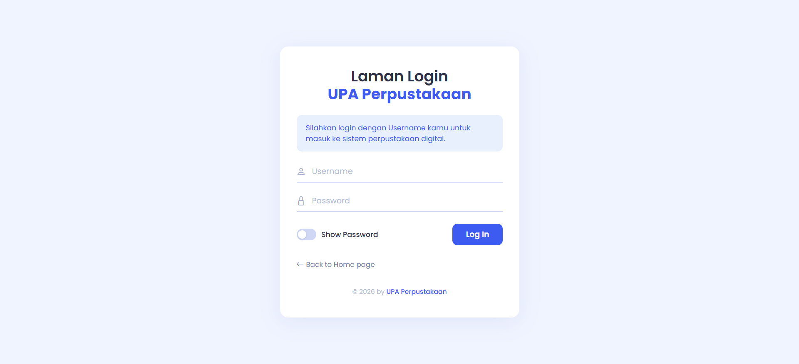
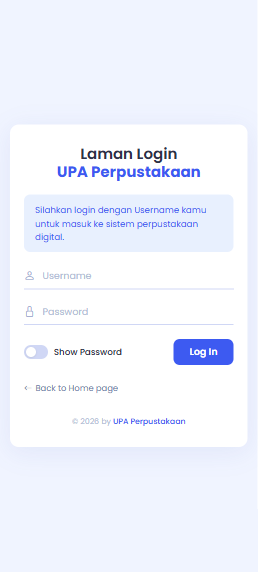
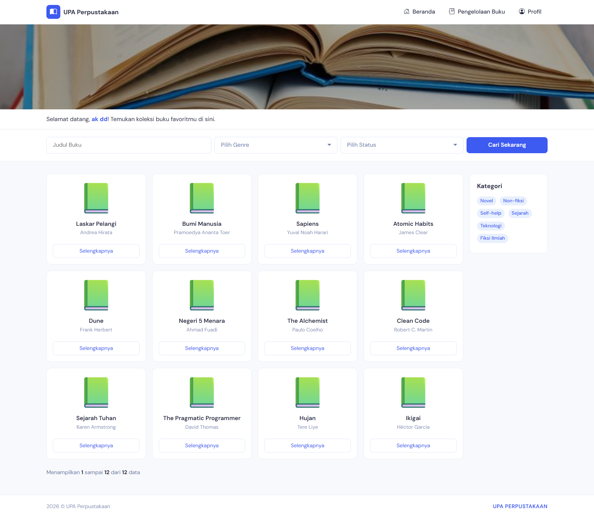
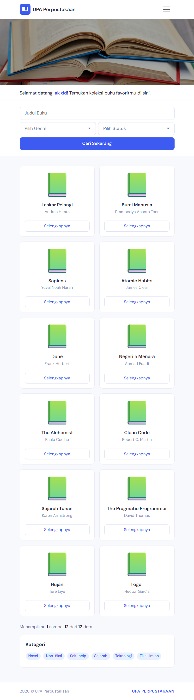
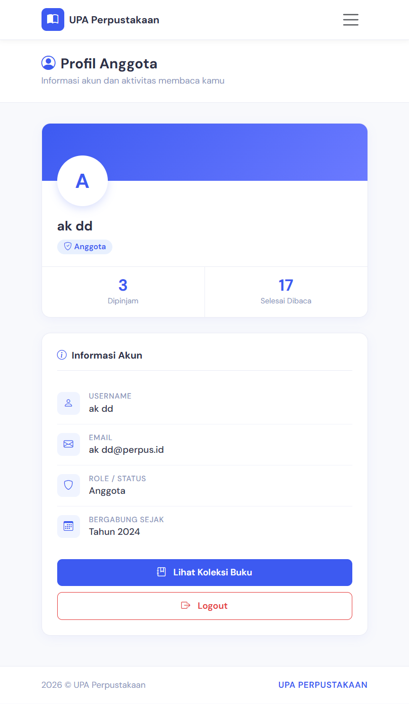
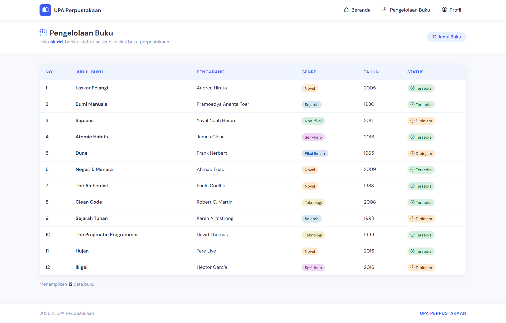
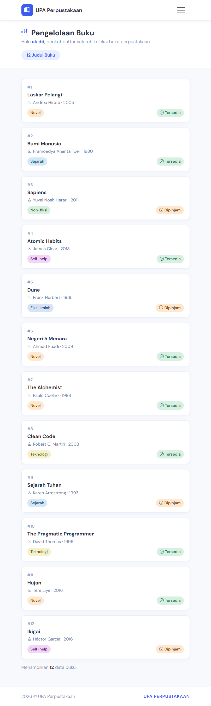

## Pengelolaan Buku Perpustakaan
### Layout Web :
<h2>Login</h2>

<h2>Dashboard</h2>

<h2>Profil</h2>

<h2>Pengelolaan</h2>

### Deskripsi :

Saya mengembangkan proyek UTS PWEB B yang berfokus pada alur penggunaan Controller dalam aplikasi web. Proses dimulai dari fitur login, di mana pengguna diminta memasukkan username. Sistem juga dilengkapi dengan validasi untuk menampilkan pesan error apabila username tidak diisi.

Selanjutnya, saya membuat fitur pengelolaan peminjaman buku yang terdiri dari halaman dashboard. Pada halaman ini ditampilkan data buku serta username pengguna yang sebelumnya diinput saat proses login. untuk isinya yaitu :
<ol>
    <li>Judul</li>
    <li>Pengarang</li>
    
</ol>
Untuk datanya ada dalam array di PageController.

 
Setelah itu ada Profil yang menampilkan username dari profil dan juga data array yaitu :
<ol>
    <li>Username</li>
    <li>Email</li>
    <li>Role</li>
    <li>Tahun Gabung</li>
</ol>

Lalu ada pengelolaan disini untuk melihat status buku dipinjam atau tersedia dan juga get data username dari login isi dari pengelolaan :
<ol>
    <li>Judul</li>
    <li>Pengarang</li>
    <li>Jenis</li>
    <li>Status</li>
</ol>

Terakhir ada logout setelah selesai user bisa logout dan semua sesi login atau username akan direset

